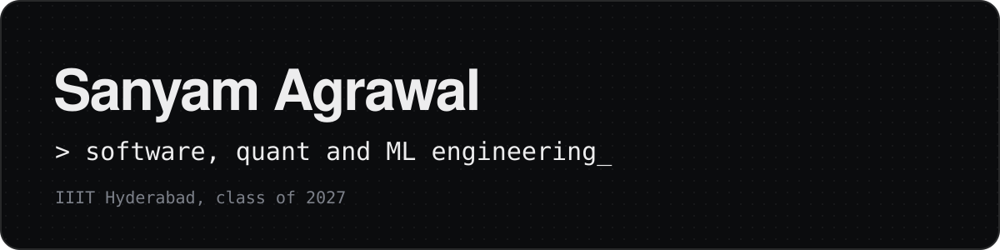
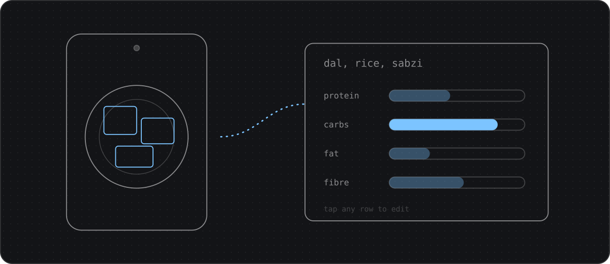

Final-year computer science student at **IIIT Hyderabad**, interested in software engineering, quantitative development and machine learning. I like problems where correctness is measurable: a backtest that has to match live trading, an ablation that changes one thing at a time, a file system that keeps working when a server dies.

**[Portfolio](https://sanyam2005.github.io)** &nbsp;|&nbsp; [LinkedIn](https://www.linkedin.com/in/sanyam-agrawal-4531a6283/) &nbsp;|&nbsp; [Résumé](https://drive.google.com/file/d/17Y99MJB4yOsG-E-NuQuKsklYKA6yCQEA/view?usp=sharing) &nbsp;|&nbsp; [Email](mailto:sanyamagrawal2005@gmail.com) &nbsp;|&nbsp; [Codeforces](https://codeforces.com/profile/tanph)

### Experience

**Microsoft**, Software Engineering Intern, AI ERP (Dynamics 365) &nbsp;`May to Jul 2026` &nbsp;`Pre-placement offer`
Designed and shipped a receipt traceability service that follows every expense receipt through seven pipeline stages, so auditors see a receipt's full history in one place. Investigations now take about a third of the time.

**PM Mockr**, Tech Intern &nbsp;`Current`
Improving the conversational and voice agents that run live mock interviews.

**Silverleaf Capital**, HFT Developer Intern &nbsp;`Dec 2025 to Jan 2026`
Built a cross-exchange backtesting framework with research-to-live parity, and researched the MCX and NYMEX natural gas spread as a lead-lag signal.

**uExcelerate**, Software Engineering Intern &nbsp;`Jan to Apr 2025`
Built the course recommendation engine for a learning platform; learners engaged with recommendations 28% more often.

### Selected projects

<table>
<tr>
<td width="50%" valign="top">

<b><a href="https://github.com/Sanyam2005/transformers-from-scratch">Transformers from scratch</a></b> 
Encoder-decoder built from tensor primitives, with a controlled ablation of RoPE, grouped-query attention and RMSNorm. 
PyTorch, Weights and Biases, Hugging Face
</td>
<td width="50%" valign="top">

<b><a href="https://github.com/Sanyam2005/ProjectX_NUTRIAI">NutriAI</a></b> 
Calorie tracking tuned for Indian meals: one photo becomes an editable nutrition breakdown. Microsoft hackathon project. 
React, FastAPI, PostgreSQL, GPT-4o vision
</td>
</tr>
<tr>
<td width="50%" valign="top">

<b><a href="https://github.com/gautambhetanabhotla/inlp-project">Legal precedent retrieval</a></b> 
Finds the earlier Indian judgments a new case should cite; role-weighted retrieval beat the course benchmark leaderboard. 
Python, BM25, Transformers, LegalBERT
</td>
<td width="50%" valign="top">

<b><a href="https://github.com/Sanyam2005/Network-File-System">Distributed network file system</a></b> 
Naming server plus storage servers over TCP, with replicas that keep files readable when a server goes down. 
C, POSIX threads, sockets
</td>
</tr>
<tr>
<td width="50%" valign="top">

<b><a href="https://github.com/Sanyam2005/IIIT-MART-MERN-STACK">IIIT Mart</a></b> 
Campus marketplace with CAS login so only students trade, and OTP-verified handovers. 
React, Node.js, Express, MongoDB
</td>
<td width="50%" valign="top">

<b><a href="https://github.com/Sanyam2005/Teleprompter">Teleprompter</a></b> 
A phone teleprompter that records while you read, so you keep eye contact and finish in one take. 
React Native, Expo, TypeScript, Reanimated
</td>
</tr>
</table>

More on the [portfolio](https://sanyam2005.github.io/#projects), including WanderMate, an OS built up from a custom shell, and ongoing RL research on LLM reasoning.

### Skills

**Languages** &nbsp; C, C++, Python, TypeScript, JavaScript, SQL
**Systems** &nbsp; Distributed systems, event-driven architecture, multi-threading, TCP/IP, Docker
**Machine learning** &nbsp; PyTorch, Transformers, information retrieval, recommender systems, computer vision, time series
**Product** &nbsp; React, React Native, Node.js, FastAPI, MongoDB, PostgreSQL, Power Platform

### Achievements

JEE Main AIR 481 among 1M+ candidates &nbsp;|&nbsp; JEE Advanced AIR 3400 &nbsp;|&nbsp; Codeforces Expert (peak 1756) &nbsp;|&nbsp; Dean's List, IIIT Hyderabad
